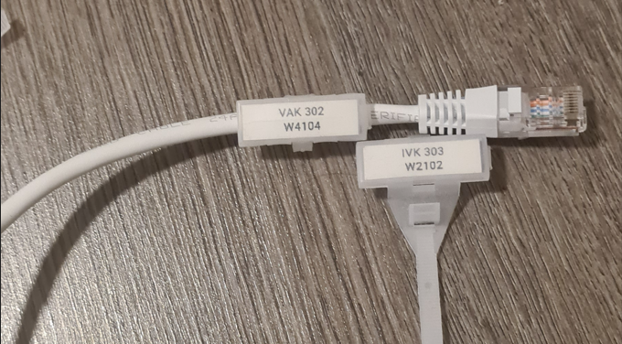
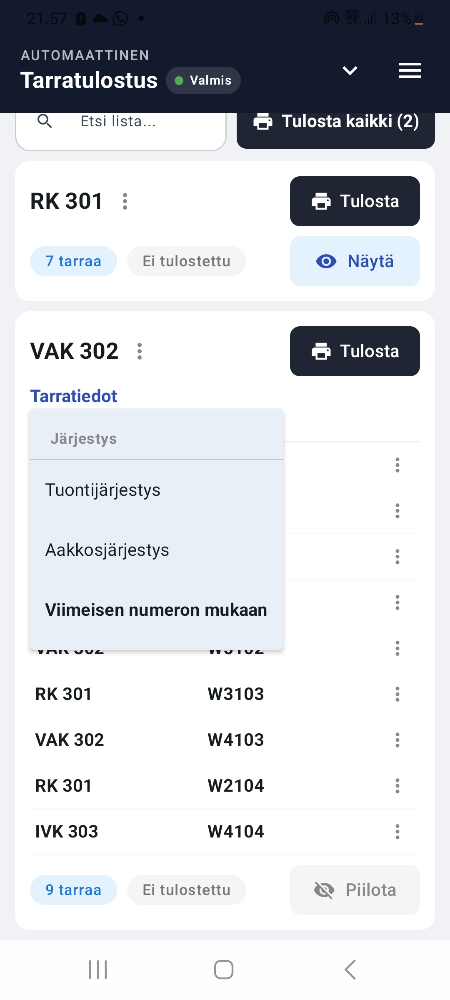

# Automaattinen kaapelitarrojen tulostus

Sähköalan työmailla kaapelit merkitään usein tunnustarroilla, ja näitä tarroja voi kertyä tulostettavaksi paljon. Jos tunnukset naputellaan yksitellen tarratulostimeen, kaapelitarrojen tulostamisesta voi tulla hidasta ja melko puuduttavaa puuhaa. 

Tästä syntyi ajatus puhelin-/tablettisovelluksesta, jossa tiettyyn työvaiheeseen liittyvät tarrat voidaan hakea listana ja lähettää tulostukseen yhdellä painalluksella.

Tavoitteena oli toteuttaa käytännön työmaatarpeeseen sopiva työkalu, jolla tarralistojen tulostaminen olisi nopeampaa ja vaivattomampaa kuin tunnusten naputtelu yksitellen tarratulostimen omalla käyttöliittymällä.

## Tarralistan haku ja tulostus

Alla olevassa videossa näkyy sovelluksen tyypillisin käyttötapaus omissa työtehtävissäni: oikea tarralista haetaan sovelluksesta, tulostus käynnistetään ja tulostuksen edetessä valmiita tarroja voidaan jo asettaa kaapelimerkintäkoteloihin eli tarrataskuihin tai jatkaa muita työvaiheita.

  
   
  <em>Tarratasku, johon valmis tarra asetetaan.</em>

Käytännössä tulostuksen aloittaminen voi olla hyvin nopeaa: usein riittää, että hakukenttään kirjoitetaan esimerkiksi listan tunnuksen loppunumerot ja painetaan tulostuspainiketta. Videolla eteneminen on tarkoituksella rauhallisempaa: alussa esitellään hieman sovelluksen ulkoasua ja työnkulku käydään läpi niin, että vaiheet erottuvat selvästi.

  <iframe
    width="360"
    height="640"
    src="https://www.youtube.com/embed/owtXGNnSl0o"
    title="Automaattinen tarratulostus - listan haku ja tulostus"
    frameborder="0"
    allowfullscreen>
  </iframe>

## Sovelluksen toiminnot ja käyttöliittymä

Sovellus tukee tarralistojen tuontia, muokkausta ja tulostamista eri käyttötapoihin. Alla oleva video esittelee tarkemmin sovelluksen toimintoja ja käyttöliittymää:

  <iframe
    width="360"
    height="640"
    src="https://www.youtube.com/embed/cHIIfsOC13M"
    title="Tarratulostussovelluksen ominaisuudet ja käyttöliittymä"
    frameborder="0"
    allow="accelerometer; autoplay; clipboard-write; encrypted-media; gyroscope; picture-in-picture; web-share"
    allowfullscreen>
  </iframe>

### Keskeiset ominaisuudet

- **Tiedostojen tuonti ja uusien tarralistojen luonti:** tarratietoja voidaan tuoda sovellukseen valmiista tiedostoista (esim. JSON ja Excel).
- **Tarralistojen muokkaus:** yksittäisiä rivejä ja listoja voidaan muokata ennen tulostamista.
- **Nykyisen ja alkuperäisen datan vertailu:** käyttäjä voi nähdä, miten listan tiedot ovat muuttuneet alkuperäiseen tuontidataan verrattuna. Alkuperäiset tiedot voidaan tarvittaessa palauttaa joko yksittäiselle riville tai koko tarralistalle.
- **Filtterit:** tarralistojen näkyvyyttä sovelluksessa voidaan rajata listan tilan ja käyttäjän määrittämien tunnisteiden perusteella.
- **Eri tulostusmoodit:** sovellus tukee tavallista tarratulostusta, kaapelilippuja ja nauhatulostusta. Kaapelilipussa sama tunnus tulostetaan tarraan kahteen kertaan, jolloin tarra voidaan kiinnittää kaapeliin lipun tapaan. Nauhatulostuksessa useat tarrat tulostetaan yhtenä pidempänä nauhana, jolloin esimerkiksi saman listan tarrat saadaan yhteen tulosteeseen. Lisäksi sovelluksessa on tuki Nauhat numeroittain -tulostukselle, jossa tarrat jaetaan erillisille nauhoille tunnuksen viimeisen numeron perusteella. Tätä käsitellään tarkemmin myöhemmin.
- **Tulostusasetukset:** tulostusasetuksissa voidaan muuttaa fonttia, fontin kokoa ja tarran pituutta sekä valita käytössä olevan tarranauhan leveys.
- **Kytkentäkuvat:** käyttöliittymässä on jo tuki kytkentäkuvien näyttämiselle testidatan avulla. Varsinainen tuotantokäyttö vaatisi vielä tavan yhdistää oikeat kytkentäkuvat oikeisiin tarralistoihin. Yksi mahdollinen ratkaisu olisi projektikansion tuonti, jossa sovellus lukee samasta kansiosta tarralistat ja kytkentäkuvat sekä yhdistää ne tiedostonimien perusteella. Tämä olisi teknisesti melko suoraviivaista, jos tiedostot on nimetty saman tunnuksen, esimerkiksi position tai keskuksen tunnuksen, mukaan.

### Suunnitteluperiaatteet

Sovelluksen käyttöliittymässä on pyritty siihen, että ohjelman käyttö olisi mahdollisimman nopeaa ja vaivatonta. Tämän vuoksi yleisten toimintojen pitää olla helposti saatavilla. Esimerkiksi yläosan valikko voidaan pitää koko ajan auki, jolloin useita asetuksia voidaan muuttaa ilman jatkuvaa valikoissa liikkumista.

Nopeassa käyttöliittymässä on kuitenkin tärkeää miettiä myös virheistä palautumista. Jos toimintoja suojataan jatkuvilla varmistusikkunoilla, käyttö hidastuu. Jos varmistuksia taas vähennetään, käyttäjälle pitää tarjota hyvä tapa kumota vahingossa tehdyt muutokset.

Tästä syystä sovellukseen on kehitteillä undo- ja redo-toiminnot. Niiden avulla esimerkiksi vahingossa tehty poisto, muokkaus tai muu kosketusvirhe voitaisiin kumota ilman, että normaalia käyttöä tarvitsee hidastaa jatkuvilla varmistuksilla.

## Käytetyt teknologiat projektissa
- **Android / Kotlin:** sovellus on Kotlinilla toteutettu Android-sovellus, joka toimii Android-puhelimessa tai tabletissa. Sovellusta käytetään työmaalla tarralistojen tuontiin, muokkaamiseen ja tulostamiseen.
- **Brother PT-E720BT:** projektissa käytetty kannettava tarratulostin, jossa on Bluetooth-yhteys, akkukäyttö ja automaattinen leikkuri. Näiden ominaisuuksien ansiosta tulostinta voidaan käyttää työmaalla suoraan puhelimen tai tabletin kanssa ilman erillistä tietokonetta.
- **Brother SDK:** Brotherin tarjoama ohjelmistokirjasto, jonka avulla Android-sovellus voi ohjata tulostinta. SDK:n kautta sovellus voi muodostaa tulostustyön, määrittää tulostusasetuksia ja lähettää tulostettavan tarran tulostimelle ilman, että käyttäjän tarvitsee käyttää tarratulostimen omaa käyttöliittymää.

## Käytännön huomioita tulostuksesta

### Tarratulostimen valinta

Projektissa käytetty Brother-tarratulostin on toiminut hyvin omasta sovelluksesta ohjattuna. Muiden valmistajien tulostimien osalta toimivuus riippuisi siitä, tarjoavatko ne vastaavan tavan ohjata tulostusta omasta ohjelmasta.

Käytännön kannalta automaattinen leikkaus on tärkeä ominaisuus. Jos käyttäjän täytyy itse katkaista jokainen tarra, osa työkalun tuomasta hyödystä menetetään. Joissakin Brotherin tarratulostimissa on lisäksi puolileikkaustoiminto, jossa tarranauha leikataan osittain mutta taustapaperi jätetään yhtenäiseksi. Tämä voi tehdä tarranauhojen käsittelystä vielä sujuvampaa, koska useat tarrat pysyvät samassa nauhassa mutta ovat silti helposti irrotettavissa yksitellen.

### Tarralistojen muodostaminen

Jotta sovelluksesta saadaan oikeaa ajansäästöä, tarratietojen täytyy tulla jostain valmiista lähteestä. Tällainen lähde voi olla esimerkiksi kaapeliluettelo, kytkentäkaavio tai muu projektidokumentti.

Käytännössä ajansäästö syntyy siitä, että lähdedata voidaan tuoda ja muuntaa ohjelman ymmärtämäksi tarralistaksi mahdollisimman automaattisesti. Jos lähtödata on selkeässä muodossa, tämä voi onnistua suoraan Excel-tuonnilla tai muulla vastaavalla muunnoslogiikalla. Tällöin tarralistojen luonti on käyttäjän näkökulmasta helppoa ja vaivatonta.

Tekoälyä tai kuvantunnistusta voisi hyödyntää erityisesti silloin, kun tarradataa poimitaan esimerkiksi kytkentäkuvista.

### Milloin työkalusta on eniten hyötyä?

Suurin hyöty syntyy tilanteissa, joissa tarrojen alkuosat vaihtelevat paljon. Käsin tarratulostimella tulostettaessa tällaiset tunnukset täytyy naputella yksi kerrallaan, mikä tekee työstä hidasta ja virhealtista.

Sama ongelma korostuu myös silloin, kun samalla kertaa halutaan tulostaa useita pieniä tarralistoja. Tällöin tunnukset vaihtuvat luonnostaan listasta toiseen, ja käsin naputtelu muuttuu helposti katkonaiseksi työksi.

Sovelluksen kannalta tunnusten vaihtelu ei itsessään lisää työmäärää, jos tarratiedot saadaan tuotua ohjelmaan automaattisesti.

### Tarrojen ryhmittely käytännössä

Kun tarroja tulostetaan paljon, pelkkä tulostusnopeus ei ratkaise koko ongelmaa. Tärkeää on myös se, että tarrat saadaan jaettua sellaisiin eriin, joista oikea tarra löytyy nopeasti työmaalla. Jos kaikki tarrat päätyvät samaan kasaan, oikean tarran etsimiseen voi mennä turhaa aikaa.

Nauhatulostusta voidaan käyttää tarrojen pitämiseen erillään. Jos samalla kertaa tulostetaan usean eri tarralistan tarroja, jokainen lista voidaan tulostaa omana nauhanaan. Tällöin eri listojen tarrat eivät sekoitu keskenään. Samaa ajatusta voidaan hyödyntää myös yhden suuren tarralistan kanssa: iso lista voidaan jakaa pienempiin osiin esimerkiksi tunnuksen loppunumeron perusteella, jolloin oikeaa tarraa ei tarvitse etsiä yhdestä suuresta tarrajoukosta.

Sovelluksessa on tuki sille, että tarrat voidaan tulostaa loppunumeron mukaan järjestettynä. Lisäksi yksittäinen tarralista voidaan tulostaa useana erillisenä nauhana loppunumeron perusteella (**Nauhat numeroittain** -tulostus). Tällöin samasta tarralistasta syntyy erilliset nauhat tunnuksen viimeisen numeron mukaan. Esimerkiksi tunnukseen `3067` kuuluva tarra löytyy nauhasta `7`.

  
   
  <em>Esimerkki tarrojen ryhmittelystä loppunumeron mukaan.</em>

### Tarranauhan materiaalihukka

Joillakin tarratulostimilla voi syntyä helposti huomaamatonta materiaalihukkaa silloin, kun tarrojen pitää olla tietyn mittaisia. Esimerkiksi tarrataskuun laitettavan tarran pitää mahtua siististi taskun sisään, joten tarralle halutaan usein kiinteä pituus, kuten noin 28 mm.

Käytännön esimerkki tästä on DYMO Rhino 4200 -tarratulostin. Kun tarran pituudeksi asetettiin 28 mm, tulostin merkitsi oikean katkaisukohdan, mutta fyysisesti leikatun tarrapalan kokonaispituudeksi tuli noin 38 mm. Tämän takia kaapelitaskuun sopivaksi leikattavasta tarrasta jäi noin 10 mm ylimääräistä häntäosaa. Materiaalihukan lisäksi ylimääräinen häntäosa täytyy joko leikata pois tai taittaa tarran taakse, mikä lisää turhaa käsityötä jokaisen tarran kohdalla.

Yksittäisessä tarrassa noin 10 mm hukka voi kuulostaa pieneltä, mutta toistuvassa käytössä määrä kasvaa nopeasti. Esimerkiksi jos yksi työntekijä tulostaa keskimäärin 30 tarraa päivässä ja jokaisessa tarrassa on noin 10 mm ylimääräistä nauhaa, hukkaa syntyy noin 0,3 metriä päivässä. Vuoden aikana tästä voi kertyä jo yli sadan euron lisäkustannus yhden työntekijän osalta.

Tässä projektissa kehitetyllä sovelluksella yhden listan tarrat voidaan tulostaa kerralla esimerkiksi Brother PT-E720BT -tarratulostimella. Tällöin tarrat voidaan tuottaa automaattisesti oikean mittaisina tarrataskuja varten, eikä jokaisen tarran perään synny erillistä ylimääräistä hukkapalaa.

## Nykyinen tilanne ja jatkokehitysideat

Kokeilu on vielä kesken, joten sovelluksen hyöty eri työtehtävissä vaatii lisää käytännön testausta. Omissa tämänhetkisissä työtehtävissä hyöty on kuitenkin ollut selvä: tarratulostus nopeutuu ja pitkien tunnusten näpyttely tarratulostimen omalla käyttöliittymällä jää pois.

Yksi kiinnostava jatkokehityssuunta olisi tarradatan tarkempi hyödyntäminen ennen tulostusta. Sovellus voisi tarkistaa dataa kovakoodattujen sääntöjen tai tekoälyn avulla ja nostaa esiin esimerkiksi epäilyttäviä tunnuksia, puuttuvia arvoja tai rivejä, jotka poikkeavat muun listan rakenteesta.

Lisäksi sovellus voisi hyödyntää kaapelitunnuksiin tai alkuperäiseen lähdedataan sisältyvää tietoa tarralistojen järjestämisessä. Joissakin työkohteissa esimerkiksi kaapelin tyyppi voi olla pääteltävissä suoraan tunnuksesta, tai se voi löytyä kaapeliluettelosta. Tätä tietoa voisi käyttää esimerkiksi kaapelityypin mukaiseen ryhmittelyyn.

<link rel="stylesheet" href="assets/css/custom.css">
